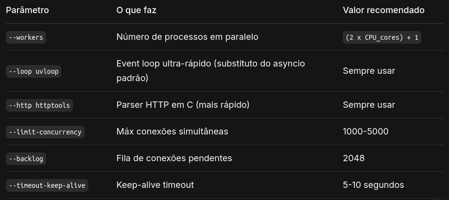

# Face recognition system - FindMyPerson 🌕
## Project Info

**Nome:** ***FindMyPerson*** 🌕

**Developers:** ***r3tnuh*** 🥶

**Architecture Pattern:** ***MVC - Model(Midleware) View Controller ⚠️***

**Description:** _Uma plataforma que ajuda os usuários a localizarem alguém perdido por meio de reconhecimento <br>
facial. Se alguém desapareceu, na vida real, o usuário vai na plataforma e publica uma foto da pessoa desaparecida<br>
e as suas informações de contacto. Se alguém encontrar alguém perdido que por algum motivo não consiga se comunicar, <br>
ou os responsáveis por essa pessoa não aparecem basta tirar uma foto da pessoa e colocar ela na categoria de encontrada, <br>
o sistema por meio de reconhecimento facial fará o match do rosto, caso o rosto perdido esteja na base de dados de <br>
rostos encontrados notifica os usuários._


## Instalation
```bash
python3 -m venv .venv
source .venv/bin/active.fish
pip install -r requirements.txt
python3 main.py
```

## Extra with mypy
### mypy instalation
```bash
pip install mypy -> but it is already in the requirements.txt
```

### A file verification
```bash
mypy meu_codigo.py
```

### A folder verification
```bash
mypy src/
```

### Ignore libraries without type hint
```bash
mypy --ignore-missing-imports meu_codigo.py
```

#### Exemplo de uso do mypy

```python
from typing import Optional

class BancoDeDados:
    def buscar(self, id: int) -> Optional[dict[str, str]]:
        # Pode retornar dict ou None
        return None

def processar_usuario(id: int) -> str:
    db = BancoDeDados()
    usuario = db.buscar(id)

    # Se esquecer de verificar None, mypy avisa!
    return f"Nome: {usuario['nome']}"  # ⚠️ mypy: usuario pode ser None
```

## Uvicorn Instrutions

### Modo Desenvolvimento (com recarga automática)
```bash
# Recarrega automaticamente quando arquivos mudam
uvicorn main:app --reload

# Especificando host e porta
uvicorn main:app --reload --host 0.0.0.0 --port 8000

# Com mais detalhes de log
uvicorn main:app --reload --log-level debug
```
### Explição
```text
uvicorn main:app
         │    │
         │    └─ Nome da variável/instância do FastAPI dentro do arquivo
         └────── Nome do arquivo Python (sem o .py)
```


### Modo Produção (alta performance)

```bash
# Configuração recomendada para produção
uvicorn main:app --host 0.0.0.0 --port 8000 --workers 4 --loop uvloop --http httptools

# Com todas as otimizações
uvicorn main:app \
  --host 0.0.0.0 \
  --port 8000 \
  --workers 4 \
  --loop uvloop \
  --http httptools \
  --limit-concurrency 1000 \
  --backlog 2048 \
  --timeout-keep-alive 5
```

### Explicação dos Parâmetros de Performance


## Emojis que serão usados ao longo do projeto

``` bash
🫥☠️👾🥶🥵🌍🌕💤🚫⛔⁉️‼️♊🇦🇴🟢⚠️❌😔😞😇
```

## Subir os arquivos para o servidor da google a partir da pasta google cloud

``` bash
gcloud compute scp --recurse /home/r3tnuh/Documents/projects/deploy-google findmyperson-backend-r3tnuh:~/findmyperson
```


## Enderecos IP publicos

``` bash
http://35.232.113.96:8000 #Backend
```

``` bash
http://35.232.113.96:4242 #Frontend
